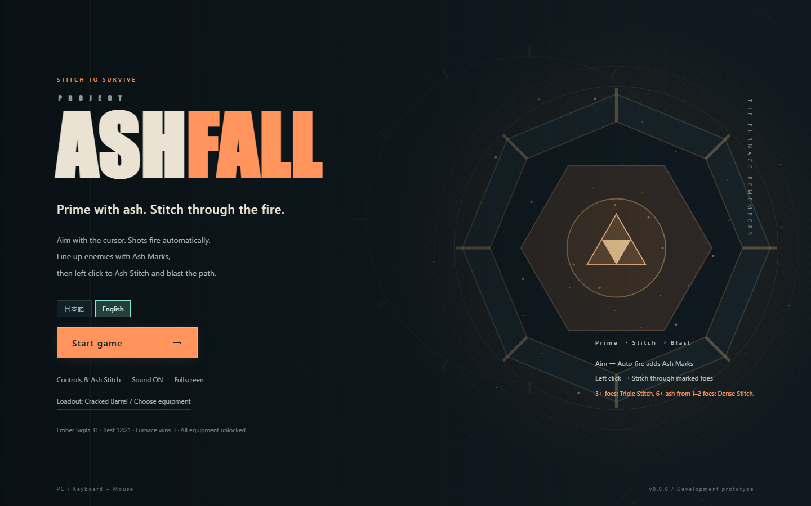

# Project Ashfall

**自動射撃で灰紋を仕込み、左クリックの灰縫いで群れを炸裂させる、見下ろしアクション・ローグライト。**

カーソルで敵を狙い、灰紋のある敵を直線の経路へまとめて縫います。青い残火を集めて強化を選び、群れに広げる「拡散」、少数に積む「濃縮」、何度も縫う「連続」を組み合わせて育てます。3・6・9分に番人、12分後に最終ボスの炉心が登場。1ランの目安は約12〜16分です。

現在のバージョンは **v0.8.1**、**Japanese / English** 対応の開発中の試作版です。バージョンはタイトル右下に表示され、[version.js](version.js)で管理しています。



タイトルの **日本語 / English** ボタンで言語を切り替えられます。再読み込みは不要で、次回起動にも選択を保存します。初回はブラウザが日本語なら日本語、それ以外は英語です。v0.7.1の残火印・装備・記録はそのまま使えます。

**English quick start:** Select **English** on the title screen, then **Start game**. Move with WASD or arrow keys and aim with the cursor. Auto-fire primes enemies with **Ash Marks**. Left click or press SPACE to **Ash Stitch** through marked foes and blast the path. Gather blue **Embers** to level up. Collect marks from 3+ foes for a **Triple Stitch**, or 6+ fresh ash from 1–2 foes for a **Dense Stitch**. **Return Stitch** and **Chain Stitch** upgrades add follow-ups. **Ember Sigils** unlock your next run's loadout. P pauses or resumes; M toggles sound. Runs take about 12–16 minutes. Extract the ZIP and open index.html; no install or network connection is needed.

## 遊び始める

ZIPを使う場合は、まずすべてのファイルを同じフォルダへ展開し、**index.htmlをブラウザで開く**と起動できます。WindowsでStart.batを同梱した配布では、それをダブルクリックしても起動できます。タイトルの「ゲーム開始」を押してください。ゲームの起動にインストールや外部通信は必要ありません。

Node.jsがある場合は、リポジトリのフォルダで `npm start` を実行し、[localhost:4173](http://localhost:4173)を開いても遊べます。サーバーの終了はCtrl+Cです。

## itch.io公開ZIPの生成

Windows PowerShell 5.1以降で、リポジトリのルートから実行します。Node.jsやnpm installは不要です。

```powershell
.\scripts\build-itch.ps1
```

`version.js` の版番号を使い、`dist/project-ashfall-v<version>-itch.zip` を生成します。`index.html` がZIPルートに入り、HTMLのローカル参照とCSSのimport/urlから必要な実行時ファイルを集めます。日英辞書も含まれ、開発文書・テスト・検証JSON・サーバーは同梱しません。生成内容を検証してから同名ZIPを置き換えます。`dist/` はGit管理対象外です。

公開ZIPの `game.js` は内部の開発用フラグだけを `false` に固定します。`?debug`、`?test`、両方を指定してもデバッグUI・5操作・テストAPIは有効にならず、通常のランと保存を使います。itch.io・ローカルHTTP・直接fileで共通です。正本ソースは変更しません。ほかのruntime fileはソースとbyte一致、`game.js` はこの1か所の変換後のbytesと一致することを検証します。必要なフラグ・両モードの入口ガード・game.js同梱が欠けた場合は生成を失敗させ、既存ZIPを保持します。

Public ZIPs disable both developer modes regardless of URL parameters, including `?debug`, `?test` and their combination. This applies on itch.io, local HTTP and offline file URLs. Gameplay and normal saving remain available; development source files retain both modes.

生成後に出力フォルダを開く場合は `.\scripts\build-itch.ps1 -OpenFolder` を使います。実行ポリシーで拒否される環境では `powershell -NoProfile -ExecutionPolicy Bypass -File .\scripts\build-itch.ps1` で、この実行だけ許可できます。展開して `index.html` を開けば、ローカルでも起動できます。itch.ioへのアップロード・公開は手動です。

配布スクリプトの回帰検証は `powershell -NoProfile -ExecutionPolicy Bypass -File .\tests\build-itch.ps1`。構成・バージョン・公開用変換・ソース不変・置き換え・必要なファイル／ガード欠落時の動作を確認します。

## 操作

| 入力 | 行動 |
| --- | --- |
| WASD / 矢印キー | 移動 |
| カーソル | 射撃と灰縫いの方向を狙う |
| 左クリック / SPACE | 灰縫いを1回実行 |
| F | 自動射撃 ON/OFF（開始時はON） |
| P | ポーズ / 再開 |
| Esc | ポーズ（全画面中はブラウザの全画面解除を優先） |
| クリック / 1・2・3 | 強化を選ぶ |
| M | 音声 ON/OFF |

射撃は自動です。左クリックは灰縫いの操作です。音声・全画面はタイトルとポーズ画面で切り替えられます。プレイ中に全画面を解除すると自動でポーズします。再開はPか「戦闘へ戻る」です。ポーズから「操作と灰縫い」を読み直せます。

## 基本の流れ

1. **狙って仕込む。** カーソルを敵へ向けると、自動射撃の命中で橙の「灰紋」が付きます。
2. **経路に入れて縫う。** 灰紋のある敵を自機と○の間へ入れ、左クリック。○まで直進して灰を回収し、軌跡が順番に炸裂します。
3. **残火を集めて育てる。** 倒した敵が落とす青い「残火」は経験値。Lvが上がると戦闘が止まり、強化を1つ選べます。
4. **次の仕込みへ。** 自機のリングが一周し、HUDが `READY` になったら次の灰縫いを使えます。新しい灰紋を狙って、繰り返しましょう。

灰紋は通常3灰まで溜まり、10秒で薄れ始めます。射撃は仕込み用で、敵へのとどめは灰縫いで狙います。緑の十字は耐久の回復です。

灰縫いはカーソル方向へ一定距離を進みます。近くをクリックしても○まで進み、開始後は方向が固定されます。長押しでは連打されません。灰を回収しない灰縫いも回避に使えます。

### 三重縫い / 密縫い

| 縫い方 | 条件と狙い |
| --- | --- |
| 三重縫い | **灰紋のある敵を3体以上まとめて縫う。** 広い消弾と待機短縮を得られ、「返し縫い」の強化で追加攻撃につながります。 |
| 密縫い | **新しい灰紋を1〜2体から合計6灰以上回収する。** 「濃灰の刻印」などで灰を積み、「密縫いの極意」「灰圧」「一点穿ち」の強化で少数への高火力を狙います。 |

追加攻撃へ引き継いだ灰は「新しい灰紋」に含みません。「密縫い」は最初から狙える成功で、強化カードの「密縫いの極意」はその威力を伸ばします。

灰を回収すると着地の短い円で飛んでくる敵弾を消せます。**地面の予告・範囲攻撃は残ります。** 灰縫い中は短い無敵時間があります。三重縫い・密縫いでの回復は「危地の息継ぎ」で追加できます。

## 強化・装備・記録

通常強化は22種・55段階。カードは「効果 → 使いどころ」、現在Lvから取得後Lv、各Lvの数値を表示します。数値はその強化単独の累計で、ほかの強化や持ち込み装備と組み合わさります。「長い縫い針」と「短針」はどちらか1つを選びます。

タイトルの「装備を選ぶ」では、開始時から効果が付く装備を1つ選びます。ランの成果で増える「残火印」が必要数に届くと装備が解放され、選んでも印を消費しません。

リザルトは1回で灰紋を回収した敵数の最大、三重縫い・返し縫い・密縫い・連環縫いの回数、消した敵弾を振り返れます。「再挑戦」は新しいランを開始し、「タイトルへ戻る」で装備を選び直せます。

## 動作環境と既知の制限

- PCのキーボードとマウス、HTML Canvas・Web Audio対応ブラウザが必要です。対応対象はMicrosoft Edge / Chrome / Firefoxです。v0.8の日英画面・保存・全画面・ポーズはWindows / Microsoft Edgeで自動検証済み。Chrome・Firefoxの基本操作はv0.7系で人間が簡易確認済みで、v0.8の追加検証は未実施です。Safariは未確認です。Supported browsers: Edge, Chrome and Firefox on desktop. v0.8 Japanese/English UI is verified in Edge; Safari is unverified.
- 1280×720以上を推奨。1024×640の画面配置も確認済みです。小さい画面では説明パネルをスクロールできます。
- タッチ・ゲームパッド・途中セーブには対応していません。タイトルへ戻ると進行中のランは終了します。
- 残火印・記録・装備選択はブラウザ内に保存します。ブラウザ・プロファイル・公開先を変えた場合の引き継ぎ機能はありません。保存が制限される環境では記録が残らない場合があります。
- 音はゲーム開始などの操作後に有効になります。全画面はブラウザの許可状況に依存します。ウィンドウを離れると自動でポーズします。
- 初見での分かりやすさ、文章の自然さ、演出の見分けやすさは、公開前に人間プレイで確認する項目です。

## クレジット・ライセンス

描画はCanvas、効果音はWeb Audioで生成します。実行時の外部ライブラリ・配布素材・音源への依存はありません。詳細は [CREDITS.md](CREDITS.md) を参照してください。

ソースコードはGitHubで参照目的で公開する方針です。**現時点ではオープンソースライセンスを設定していません。** 再利用・改変・再配布・商用利用などの許諾方針は今後検討します。初回公開時はLICENSEファイルを追加せず、将来のライセンス設定は未定です。決定事項とクレジットの確認事項は [ライセンスとクレジットの準備](docs/V0.7-LICENSE-AND-CREDITS.md) に記録しています。

## 開発者向けデバッグ / Developer debug

開発用ソースのブラウザ版のURLに `?debug` を付けます。HTTPなら `http://localhost:4173/?debug`、オフラインならブラウザのアドレス欄で `file:///D:/.../index.html?debug` のように指定してください。公開ZIPでは両方の開発用モードを無効に固定するため、この操作は利用できません。通常起動には入口も操作もありません。タイトル・ラン・結果の右上に「開発デバッグ」と無敵状態を表示します。自動検証用の `?test` APIとは別の機能です。

ラン開始後、右上の「デバッグを開く」をクリックします。戦闘は停止します。閉じてもポーズを維持し、Pか「戦闘へ戻る」で再開します。パネル内のキーはゲームへ伝わりません。Escでもパネルを閉じられます（全画面中はブラウザの退出を優先）。強化カード選択中、結果、ランなしでは操作できず、理由を表示します。

- **強化**：全23種から選び、1ランクずつ付与。通常の上限・前提・排他条件を守ります。連環縫いは先に返し縫いを付与してください。尽きない残火には取得可能な通常強化の最大ランクが必要です。XP・レベル・保留カードを消費せず、取得数とHUD／ビルドへ反映します。
- **経過時刻**：正の秒数だけ進め、上限は最終ボス出現時刻の12:00。飛ばした移動・攻撃・被弾・XP・回復・クールダウンは再現しません。再開後に現在時刻で出現判定を行い、中間のwaveを全部再演しません。時刻変更だけでは勝利や報酬を確定しません。
- **ボス**：守護者か最終ボスを呼び出します。生存中のボス類がいれば拒否します。手動の守護者は次の予定枠を消費し、生存中に時刻を飛ばしても守護者を重ねません。最終ボスは通常と同じ移行（既存敵・敵弾・地面攻撃の整理）と撃破終了を使います。呼出しで時計は進みません。
- **敵**：ボス類を除く全6種を、1回1〜25体、生存敵の合計100体まで追加できます。現在時刻の能力を使い、自機の周辺160〜230の距離をアリーナ内へ収めて配置します。100体はデバッグ追加の上限で、戦闘中の通常生成・分裂等のルールは維持します。
- **無敵**：ON中は敵接触・敵弾・地面攻撃によるHP減少を防ぎます。移動・射撃・灰縫い・回復は通常どおりです。OFFで通常の被弾へ戻り、新ラン・リトライではOFFになります。

デバッグ起動中の成績・残火印・解放・装備変更はセッション内だけです。開始、結果、リトライ、タイトル復帰、装備補正を含め、通常metaへ書き戻しません。再読込ではデバッグの取得強化・設定・成果を持ち越しません。言語設定だけは通常どおり保存します。通常ランへ戻すには、URLから `debug` を外して再読込してください。デバッグの勝利や強さは通常のバランス評価と区別してください。

Append `?debug` to the development source's HTTP or offline file URL. Public ZIPs disable both `debug` and `test`. Start a run and click **Open debug panel**. Combat stops; closing leaves the run paused. Resume with P or the usual resume button. The panel grants one upgrade rank with normal prerequisites and exclusions, advances elapsed time only (up to 12:00), summons an existing guardian/final boss, spawns 1–25 regular enemies per action (100 living enemies total), and toggles invincibility. Skipped combat and cooldowns are not simulated. Scheduled spawns are checked after resuming; manual guardians occupy the next scheduled slot, and the final boss uses the normal encounter transition. Invincibility resets on a new run/retry. Records, sigils, unlocks and loadout changes stay in this session; language preferences still persist. Reload without `debug` for a normal run. The `?test` automation API is separate.

自己確認：`npm test` に開発用デバッグ境界10件と公開用モード検証11件を含みます。開発用ソースの実ブラウザは専用CDPプロファイルで `npm run test:debug:browser` を実行します。HTTP／file、日英、1440×900／1024×640／640×480のパネル、実キー／クリック、保存・ボス遷移を確認します。接続先は `ASHFALL_CDP_PORT`（既定9223）。新規証拠は `work/debug-browser/` に出力します。ブラウザ準備は [既存の手順](docs/V0.8-I18N-VALIDATION.md#ブラウザ検証の再実行) を参照。今回の実行結果・未確認事項は [現在のスプリント](plans/current-sprint.md) に記録しています。

公開ZIPはリポジトリ内の新規フォルダ（例：`work/public-check/`）へ展開し、`npm start` と専用CDPブラウザを準備して、PowerShellで次を実行します。旧 `ASHFALL_DEBUG_PACKAGED_DIR` は使用しません。

```powershell
$env:ASHFALL_PUBLIC_DIR = 'work/public-check'
npm run test:public:package
Remove-Item Env:ASHFALL_PUBLIC_DIR
```

生成物そのもののHTTP／file × 通常／debug／test／test&debug × 日英の16条件で、test API不在、入口／5操作の無効化、通常ラン・保存・言語切替／再読込を確認します。両指定の条件では自然被弾による敗北・リトライとnative fullscreenも確認します。証拠は `work/public-package-browser/`。`ASHFALL_PUBLIC_DIR` を指定して `node tests/public-modes.cjs` を実行すると、展開版のVM検証もできます。テストは既存描画コールバックを捕捉して進めるfixtureとCDP入力を使います。人間の操作感・音の聴感の確認とは区別します。

## 開発・公開準備の資料

- [AI開発の共通ルールと役割・ワークフロー](AGENTS.md)
- [現在のスプリント](plans/current-sprint.md) / [次回の開始手順と雛形](plans/README.md)
- [公開前チェックリスト・配布手順](docs/V0.7-PUBLIC-READINESS.md)
- [全強化の旧説明・新説明・変更理由](docs/V0.7-UPGRADE-COPY-REVIEW.md)
- [タイトル・ヘルプ・導入・リザルトの変更全文](docs/V0.7-PLAYER-COPY-REVIEW.md)
- [v0.8 構造棚卸しと分離方針](docs/V0.8-REFACTOR-PLAN.md)
- [v0.8 日英用語表](docs/V0.8-I18N-GLOSSARY.md)
- [v0.8 全翻訳一覧](docs/V0.8-I18N-REVIEW.md)
- [v0.8 検証・ファイル構成・残した境界](docs/V0.8-I18N-VALIDATION.md)
- [検証結果と再実行方法](TEST-REPORT.md)

自動テストは `npm test`、v0.7.1との日英6seed比較は `npm run test:balance`。どちらもNode.jsのみで動作します。言語だけの検証は `npm run test:i18n`、実ブラウザ検証は `npm run test:i18n:browser`。辞書は `i18n/ja.js` / `i18n/en.js`、翻訳一覧の再生成は `npm run i18n:review`。ブラウザ準備と回帰の手順は [v0.8検証文書](docs/V0.8-I18N-VALIDATION.md) にまとめています。
