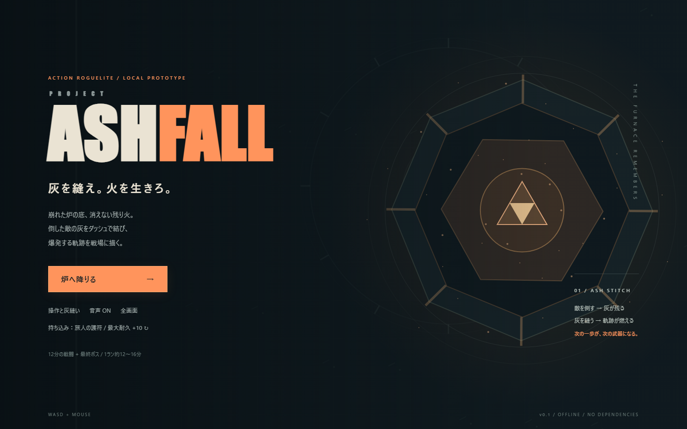

# Project Ashfall

**灰を縫え。火を生きろ。**

PC向けの見下ろしアクション・ローグライト。倒した敵の灰をダッシュで取り込み、爆発する軌跡を作ります。12分間の戦闘を生き残り、最後の炉心を倒すとクリア。クリアまで約12〜16分を想定しています。死亡したランは早く終了します。



## 起動

**インストール不要。`Start.bat` をダブルクリックしてください。**

`index.html` をEdge / Chrome / FirefoxなどのPCブラウザで直接開いても遊べます。フォルダ内の `index.html`、`style.css`、`game.js` は一緒に置いてください。外部通信、アカウント、素材のダウンロード、有料APIは不要です。音と絵もローカルで生成しています。

Node.jsがある場合は、フォルダ内で次の方法も使えます。依存関係の導入は不要です。

```text
npm start
```

[http://localhost:4173](http://localhost:4173) を開きます。終了はサーバーのウィンドウでCtrl+C。ポートが使用中の場合はPowerShellで `$env:PORT=4174; npm start` とし、localhost:4174を開いてください。

検証環境はWindows / Chromiumです。スマートフォン、タッチ操作、ゲームパッドには対応していません。まず1280×720以上の画面を推奨します。1024×640でも画面配置を確認しています。

## 操作

| 操作 | 入力 |
| --- | --- |
| 移動 | WASD / 矢印キー |
| 照準 | マウス |
| 射撃 | 左クリック長押し |
| 自動射撃の切り替え | F（照準はマウスのまま） |
| 灰縫いダッシュ | SPACE |
| 強化を選択 | クリック / 1・2・3 |
| 一時停止・再開 | Esc / P |
| 音声切り替え | M |
| 全画面 | タイトルの「全画面」 |

ダッシュは移動方向に出ます。停止中は照準方向です。ダッシュ中は無敵。SPACEを長押しすると、待機時間が終わるたびに再度ダッシュします。ウィンドウを離れたときは自動的に一時停止します。

## 最初の1分

1. 左クリックを長押しするかFを押し、動きながら敵を撃ちます。
2. 倒した敵は**橙色の灰**と**青い経験値（残火）**を残します。
3. 灰のある場所をSPACEで走り抜けます。0.35秒後に軌跡が爆発し、約1秒間燃え続けます。
4. 灰を多く拾うほど威力が上がり、ダッシュの待機時間も短縮されます。経験値と回復も軌跡に沿って回収します。
5. レベルが上がったら、最初は「散火の銃身」「太陽の縫い目」「小さな太陽」のどれかを選びます。その後も銃・灰縫い・支援の3方向から選べます。

灰のないダッシュは回避用です。強い攻撃を出すには灰を使ってください。灰は約20秒で消えるので、撃つ場所と次の経路を一緒に考えるのがコツです。回復は緑の十字。赤い円や敵の直線予告から離れると大きな攻撃を避けられます。

## 成長と目標

- 強化15種類と、すべてを取り切った場合の追加強化。散弾・貫通・跳弾、灰縫いの広域化・再爆発・減速・回復、自律火球などを組み合わせます。
- 6種類の通常敵と、3分・6分・9分の番人。12分後に最終ボス「炉心」。炉心は耐久50%未満で攻撃が激しくなります。
- ラン終了時に「残火印」を獲得。印が5 / 12 / 25に達すると持ち込み装備を解放します。タイトルの「持ち込み」をクリックすると解放済み装備を切り替えられます。
- 印、最長生存時間、クリア回数、持ち込み選択はブラウザに保存します。途中のランは保存しません。ブラウザ・プロファイル・起動URLを変えると記録が別になる場合があります。保存が制限されてもゲーム自体は動きます。

## ファイルと検証

- [ゲームデザイン概要](DESIGN.md)
- [自己レビュー](REVIEW.md)
- [検証結果と限界](TEST-REPORT.md)
- `game.js`：戦闘・描画・音・保存。`style.css` / `index.html`：画面とUI。
- `server.js`：任意のローカルサーバー。配布版は直接ファイルを開くだけでも動作します。

Node.jsで `npm test` を実行すると20項目の主要機能を検証できます。`node tests/balance.cjs` は3種類の自動プレイヤーによる戦闘シミュレーションです。ブラウザ検証に使用した手順は `tests/browser-check.cjs` に収録しています。

指定された作業先は `D:\develop\ashfall` でしたが、制作環境の書き込み制限により配置できませんでした。このフォルダの内容をそこへコピーすれば、同じ方法で起動できます。既存フォルダの削除は不要です。
