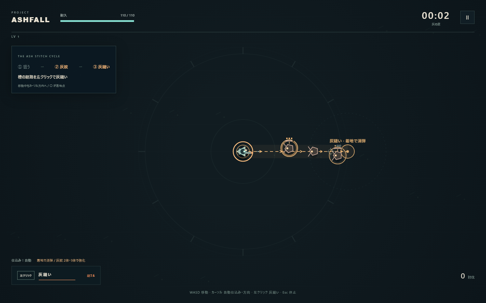

# Project Ashfall v0.4

**狙って仕込む。クリックで縫い、軌跡を炸裂させる。**

カーソル方向へ自動射撃して敵に灰紋を刻み、直線の灰縫いで回収・連続起爆する見下ろしアクション・ローグライト。v0.4は**良い灰縫いほど着地で守られ、強化の組み合わせで攻撃が変わる**実験です。



## 起動

**Start.batをダブルクリック。インストール不要。** index.htmlをPCブラウザで直接開いても動作します。index.html、game.js、style.cssを同じフォルダに置いてください。外部通信、外部素材、有料API、追加フレームワークは使いません。

Node.jsがある場合は、フォルダ内で `npm start` を実行して [localhost:4173](http://localhost:4173) を開けます。終了はCtrl+C。ポートが使用中ならPowerShellで `$env:PORT=4174; npm start` としてlocalhost:4174を使用してください。

Windows / Chromiumで検証。1280×720以上を推奨し、1024×640の配置も確認。タッチ・ゲームパッド・途中セーブは未対応です。

## 操作

| 入力 | 行動 |
| --- | --- |
| WASD / 矢印 | 移動 |
| カーソル | 自動仕込みと灰縫いの方向 |
| 左クリック | 灰縫いを1回実行 |
| SPACE | 灰縫いの代替入力 |
| F | 自動仕込みを休止／再開（最初はON） |
| Esc / P | 一時停止／再開 |
| クリック / 1・2・3 | 強化選択 |
| M | 音声切替 |

灰縫いは**移動入力に関係なく、カーソル方向へ基本310の距離を直進**します。近い場所をクリックしても、表示した○の着地点まで進みます。壁際では経路を短縮します。開始時に終点を固定するため、途中でカーソルを動かしても曲がりません。長押しによる自動連打はありません。全画面はタイトルから選べます。ウィンドウを離れると自動休止します。

## 最初の戦闘

1. 最初の1.6秒は敵なしで自動射撃。続いて止まった3体が現れます。敵へカーソルを向けると、仕込み弾が灰紋を刻みます。
2. 灰紋の敵を予告経路に重ねると橙色になります。始点の輪、矢印、終点の○を確認。
3. 左クリックで直進。灰紋を吸い取り、0.09秒の予熱後、軌跡が始点から約0.28秒かけて連続起爆します。
4. 灰を回収すると着地に短い消弾領域。灰紋のある敵3体以上で**三重縫い：広く長い消弾、範囲内の爆発予告解除、耐久+4、待機時間を追加で0.35秒短縮**。緑の予告で狙えます。灰のない灰縫いでは消弾領域が生まれません。

自機のリングが一周すると灰縫い可能。欠けている間は待機中、使用可能になると一瞬発光します。「返し縫い」を取った三重縫いでは緑の二重リングと「もう1回」が出て、2秒以内に追加攻撃できます。

通常移動では灰を取れず、射撃だけでは倒し切れません。灰なしの灰縫いは回避用。灰縫い中と着地直後は短い無敵時間があり、経路上の敵弾も消します。青い残火は経験値、緑の十字は回復です。

最初の3分は接触・敵弾の圧力と密度を抑え、5分までは射手を単発、通常敵を1体ずつ出現させます。それ以降も射手数と通常敵密度を制限し、番人撃破後には4秒の出現休止を入れました。仕込み弾は太めの判定と狭い方向補正で当てやすくしています。完全な自動照準ではありません。

灰紋は通常3段階、10秒で薄れ始めます。既存の強化数を増やさず、組み合わせの変化を強めました。

| 組み合わせ | 変わる行動 |
| --- | --- |
| 灰の串 ＋ 隣へ渡す灰 | 貫通で奥へ進みながら、横にも跳弾が枝分かれ |
| 濃灰の刻印 ＋ 扇／貫通／跳弾 | 満杯の敵から近くへ伝染し、三重縫いの経路を作る |
| 三重縫い ＋ 返し縫い | 灰を半分引き継ぎ、2秒以内にもう1回。追加攻撃からの無限連鎖なし |
| 二重の縫い目 ＋ 返し縫い／長い縫い針 | 逆向きの再炸裂と新しい灰縫いを重ねる |
| 危地の息継ぎ ＋ 三重縫い | 回復、消弾範囲と持続が伸び、さらに踏み込める |

既存の通常敵6種類、3・6・9分の番人、12分後の炉心を使用。1ラン約12〜16分、死亡時は早く終了。残火印と持ち込み装備は従来のブラウザ保存を引き継ぎます。タイトルの「装備を選ぶ」で4種類の効果・解放条件・選択中の装備を一覧表示。残火印は解放条件であり、選択時には消費しません。

## 検証と記録

```text
npm test
npm run test:balance
npm run test:browser
```

主要テストと加速シミュレーションはNode.jsのみ。シミュレーションはv0.3ブランチのソースを読み取り専用で比較します。配布版に比較ブランチがなければ比較のみ省略。

ブラウザ検証はlocalhost:4173とDevToolsポート9223のローカルChromiumを使用し、約8〜10分かかります。サーバーと、別ターミナルのChromiumを `--headless --remote-debugging-port=9223 --user-data-dir="%TEMP%\ashfall-browser-test"` で起動してから実行してください。Windowsでは通常 `C:\Program Files\Google\Chrome\Application\chrome.exe` を使えます。テスト用プロファイルを使い、他のページを開かないでください。ゲームの起動にはこれらの手順は不要です。

自動操作の合格を面白さの証明とは扱いません。7分の実時間入力は体力・灰・経験値・時計を追加せず進め、演出を止めて見る場面は別途明示的なテスト状態を使います。

- [v0.4の変更・人間の確認項目・強化の組み合わせ](docs/V0.4-FLOW-AND-BUILDS.md)
- [デザイン概要](DESIGN.md)
- [自己レビュー](REVIEW.md)
- [検証結果](TEST-REPORT.md)
- [v0.1→v0.2の履歴](docs/V0.2-CORE-LOOP.md)
- [v0.2→v0.3の履歴](docs/V0.3-PLAY-FEEL.md)

作業ブランチ：experiment/ash-stitch-flow。main、experiment/ash-stitch-core、experiment/ash-stitch-feelは変更せず、mergeもしていません。
