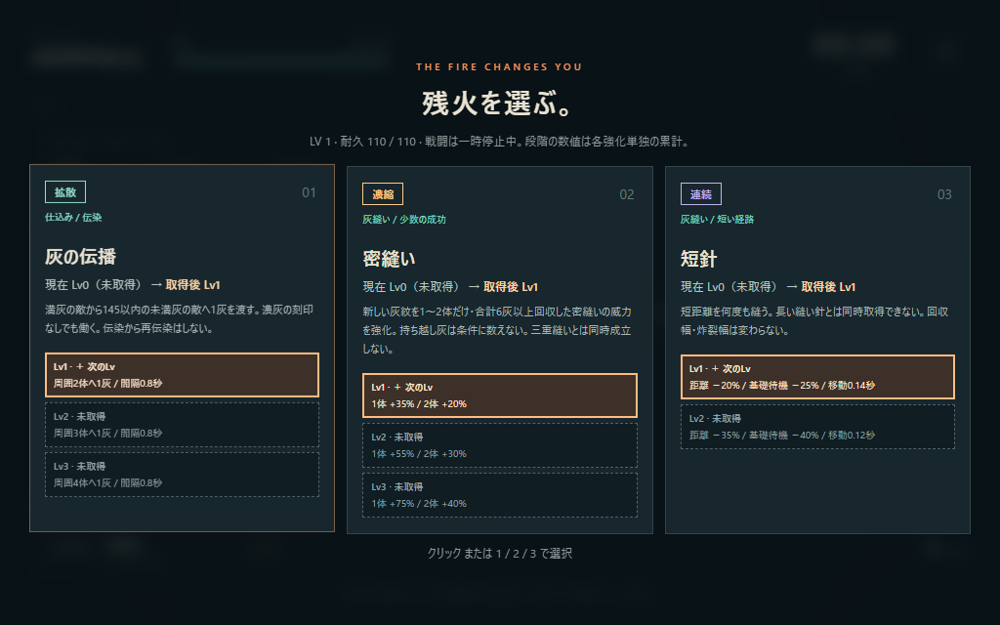
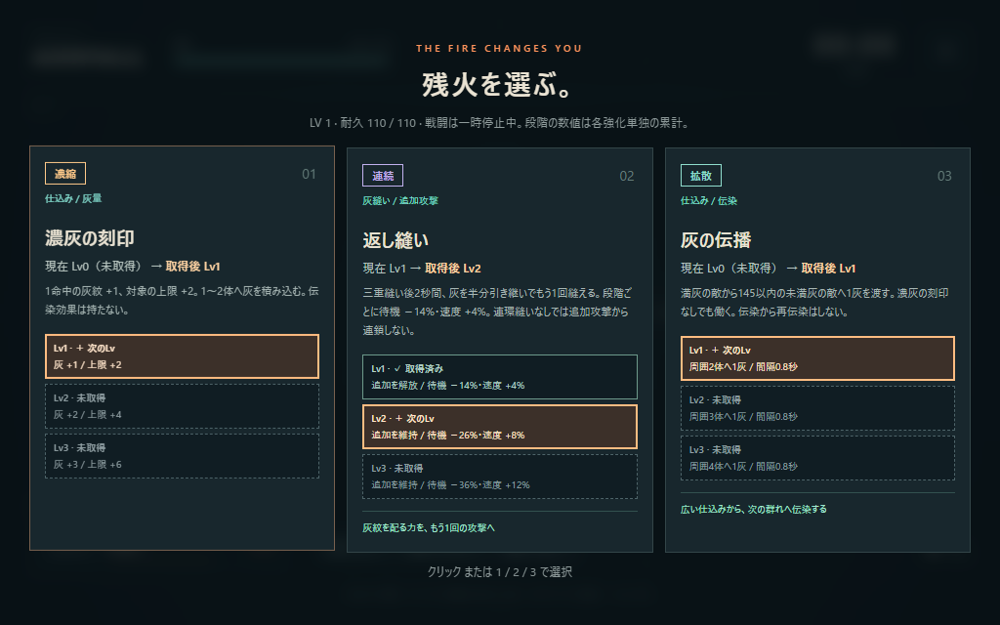

# Project Ashfall v0.6.3

通常の橙の連鎖爆発を基準に、密縫いは白熱した高密度の連鎖、三重縫いは青緑の広域の連鎖として表現します。v0.6.3は視覚・音だけの調整です。本撃・再炸裂の前線通過時だけの命中と、強化内容・威力・敵性能などの数値は維持しています。

**狙って仕込む。クリックで縫い、軌跡を炸裂させる。**

カーソル方向へ自動射撃して敵に灰紋を刻み、直線の灰縫いで回収・連続起爆する見下ろしアクション・ローグライト。群れに広く仕込む「拡散」、少数へ濃く積む「濃縮」、何度も縫う「連続」を組み合わせ、ランごとの灰縫いを育てます。



## 起動

**Start.batをダブルクリック。インストール不要。** `index.html` をPCブラウザで直接開いても動作します。`index.html`、`game.js`、`upgrades.js`、`style.css` を同じフォルダに置いてください。ゲームは外部通信・外部素材・追加フレームワークを使いません。

Node.jsがある場合は `npm start` を実行し、[localhost:4173](http://localhost:4173) を開きます。終了はCtrl+C。別ポートを使う場合はPowerShellで `$env:PORT=4174; npm start` を実行します。

Windows / Chromiumで検証。1280×720以上を推奨し、1024×640の配置も確認しています。タッチ・ゲームパッド・途中セーブには対応していません。

## 操作

| 入力 | 行動 |
| --- | --- |
| WASD / 矢印 | 移動 |
| カーソル | 自動仕込みと灰縫いの方向 |
| 左クリック | 灰縫いを1回実行 |
| SPACE | 灰縫いの代替入力 |
| F | 自動仕込みを休止／再開（最初はON） |
| Esc / P | 一時停止／再開 |
| クリック / 1・2・3 | 強化選択 |
| M | 音声切替 |

灰縫いは移動入力に関係なく、カーソル方向へ基本310の距離を直進します。近くをクリックしても、予告の○まで進みます。壁際では経路を短縮。開始時に終点を固定するため、途中でカーソルを動かしても曲がりません。長押しによる自動連打はありません。全画面はタイトルから選べます。ウィンドウを離れると自動休止します。

## 戦闘の流れ

1. 最初の1.6秒は敵なしで自動射撃。その後、安全な3体が現れます。敵へカーソルを向け、橙の灰紋を刻みます。
2. 灰紋のある敵を予告経路に重ね、左クリックで灰縫い。灰を吸い取り、0.09秒の予熱後、軌跡が始点から約0.28秒かけて連続起爆します。
3. 灰を回収すると着地に短い消弾領域。3体以上なら「三重縫い」で広い消弾と待機の追加0.35秒短縮。1〜2体から6灰以上なら「密縫い」で、濃縮強化の高火力を狙えます。回復は「危地の息継ぎ」で追加します。
4. 新しく灰を仕込み、次の経路を選びます。「返し縫い」があれば三重縫いから灰を半分引き継いで2秒以内に追加1回。「連環縫い」があれば、返しで新しい灰紋を回収すると最後のもう1回へつながります。

射撃だけでは倒し切れず、通常移動では灰を回収できません。灰なしの灰縫いは回避用で、消弾領域も生まれません。灰紋は通常3段階、10秒で薄れ始めます。青い残火は経験値、緑の十字は回復です。

**消弾対象は飛翔する敵弾だけです。** 灰縫いの経路と着地領域で弾を消せますが、地面の着弾予告・範囲攻撃・番人と炉心の地面攻撃は残り、予定どおり発動します。灰縫い中と着地直後には短い無敵時間があります。

自機のリングが一周すると使用可能。待機中は欠け、完了時に発光します。HUDの `READY` も使用可能を示します。返し縫いは緑の二重リングとHUDの「返し縫い」で確認できます。着地点の説明文は導入中だけ表示し、灰のある灰縫いを3回行うか、初討伐から20秒経過すると消えます。以後も色・リング・矢印・消弾予告は残ります。説明は「操作と灰縫い」から読み直せます。

通常敵6種類、3・6・9分の番人、12分後の炉心が登場します。1ラン約12〜16分、死亡時は早く終了します。序盤の低密度・被ダメージ軽減、後半の敵数・射手数の上限、番人撃破後4秒の出現休止を継続しています。

## 強化とランの記録

| 組み合わせ | 変わる行動 |
| --- | --- |
| 灰の串 ＋ 隣へ渡す灰 | 貫通の主弾は直進し、横へ跳弾が分岐。跳弾だけが短く軌道を補正し、動く敵へ灰を渡す |
| 灰の伝播 ＋ 扇／貫通／跳弾 | 満灰の敵から近くへ伝染し、三重縫いの経路を作る。濃灰の刻印には伝染がない |
| 飛び散る残灰 ＋ 返し縫い | 炸裂から最大6〜9発の小さな灰弾を撒き、次の灰縫いへ仕込む |
| 濃灰の刻印 ＋ 密縫い／灰圧／一点穿ち | 1〜2体へ積んだ灰を高火力へ変え、単体なら集中爆発を加える |
| 三重縫い ＋ 返し縫い ＋ 連環縫い | 通常→返し→連環の最大3回。各追加は2秒以内で、連環からは連鎖しない |
| 短針 ＋ 早縫い | 短い経路を何度も縫う。長い縫い針と短針は同時取得できない |
| 二重の縫い目 ＋ 返し縫い／長い縫い針 | 逆向きの再炸裂と、新しい灰縫いを重ねる |
| 危地の息継ぎ ／ 広がる灰幕 | 回復と消弾を別々に選ぶ。回復は三重縫い・密縫いの両方で得られる |

通常強化22種・全55段階。「拡散・濃縮・連続・共通」の文字タグが付き、混成も可能です。同系統の出現重みは最大25%だけ上がります。強化カードは「現在Lv → 取得後Lv」と各段階の効果を表示し、✓取得済みは実線、＋次のLvは太い枠、未取得は破線で区別します。数値は各強化単独の累計で、ほかの強化・持ち込み装備と合成されます。



終了画面では「最大同時灰縫い」「三重縫い回数」「返し縫い回数」「消した敵弾数」に加えて密縫い・連環縫い回数を振り返れます。最大同時灰縫いは1回で灰紋を回収した敵数、消した敵弾数は経路と着地領域の合計です。

残火印と持ち込み装備はブラウザに保存します。タイトルの「装備を選ぶ」で旅人の護符・灰織りの針・割れた銃身から1つ選びます。残火印は解放条件で、選択時には消費しません。v0.5では役割の重なっていた衛星を強化と装備から外しました。以前の衛星装備を選択した保存は旅人の護符へ戻し、残火印・記録・ほかの装備の選択は引き継ぎます。

v0.6では地面配置の「零れる灰」を候補と処理から外しました。ラン内の強化は保存されていないため、既存の残火印・記録・装備は引き続き使えます。

## 検証と設計資料

```text
npm test
npm run test:balance
npm run test:browser
node tests/clarity-check.cjs
node tests/hazard-check.cjs
npm run test:feedback
```

主要テストと加速シミュレーションはNode.jsのみで動作します。バランス検証は、v0.6.2の `028ca08` を読み取り専用で取得し、同じ6seed・強化選好・経路計画で結果・取得・ダメージ・途中サンプルの完全一致を確認します。配布版にGit履歴がなければ比較だけ省略します。

ブラウザ検証は `npm start` とDevToolsポート9223のChromiumを使います。Windowsの例：

```powershell
& 'C:\Program Files (x86)\Microsoft\Edge\Application\msedge.exe' --headless=new --remote-debugging-port=9223 --user-data-dir="$env:TEMP\ashfall-browser-test" http://localhost:4173/?test
```

専用プロファイルを使い、他のページを開かず、別ターミナルでテストを順番に実行してください。全体のブラウザ検証は最大7分の実時間入力を含み約8〜10分です。通常入力中に死亡した場合も結果を保存し、残る画面・戦闘回帰を検証します。合格は生存の保証ではありません。UXと地面攻撃を確認する `clarity-check.cjs` は短い個別場面の検証です。ゲームの通常起動にはDevToolsは不要です。

- [v0.6の仕様・数値・次の人間プレイの確認点](docs/V0.6-BUILD-DIVERSITY.md)
- [v0.6.1の演出と比較ページの使い方](docs/V0.6-STITCH-FEEDBACK.md)（専用ブラウザ検証：`npm run test:feedback`）
- [v0.6.2の音・経路表現・前線命中と人間確認項目](docs/V0.6.2-STITCH-TIMING.md)
- [v0.6.3の連鎖爆発・音の変奏と人間確認項目](docs/V0.6.3-STITCH-CHAIN-VISUALS.md)
- [現在のデザイン概要](DESIGN.md)
- [自己レビュー](REVIEW.md)
- [検証結果](TEST-REPORT.md)
- 履歴：[v0.2](docs/V0.2-CORE-LOOP.md)、[v0.3](docs/V0.3-PLAY-FEEL.md)、[v0.4](docs/V0.4-FLOW-AND-BUILDS.md)、[v0.5](docs/V0.5-UX-AND-CLARITY.md)
