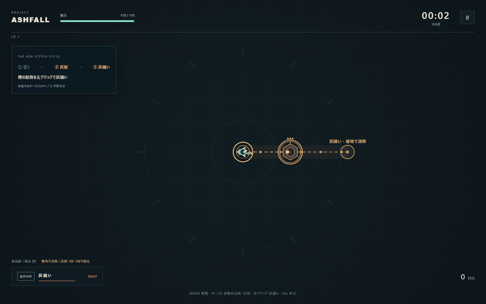
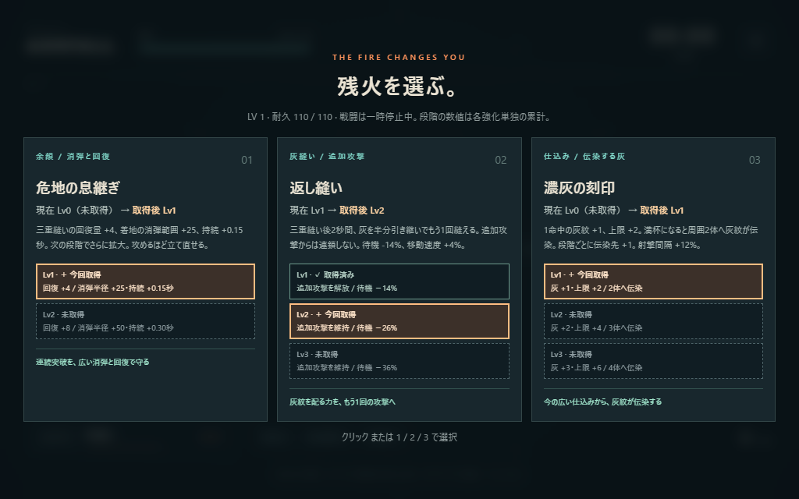

# Project Ashfall v0.5

**狙って仕込む。クリックで縫い、軌跡を炸裂させる。**

カーソル方向へ自動射撃して敵に灰紋を刻み、直線の灰縫いで回収・連続起爆する見下ろしアクション・ローグライト。灰紋をまとめた経路ほど、着地の消弾と回復で次の攻撃へつながります。



## 起動

**Start.batをダブルクリック。インストール不要。** `index.html` をPCブラウザで直接開いても動作します。`index.html`、`game.js`、`style.css` を同じフォルダに置いてください。ゲームは外部通信・外部素材・追加フレームワークを使いません。

Node.jsがある場合は `npm start` を実行し、[localhost:4173](http://localhost:4173) を開きます。終了はCtrl+C。別ポートを使う場合はPowerShellで `$env:PORT=4174; npm start` を実行します。

Windows / Chromiumで検証。1280×720以上を推奨し、1024×640の配置も確認しています。タッチ・ゲームパッド・途中セーブには対応していません。

## 操作

| 入力 | 行動 |
| --- | --- |
| WASD / 矢印 | 移動 |
| カーソル | 自動仕込みと灰縫いの方向 |
| 左クリック | 灰縫いを1回実行 |
| SPACE | 灰縫いの代替入力 |
| F | 自動仕込みを休止／再開（最初はON） |
| Esc / P | 一時停止／再開 |
| クリック / 1・2・3 | 強化選択 |
| M | 音声切替 |

灰縫いは移動入力に関係なく、カーソル方向へ基本310の距離を直進します。近くをクリックしても、予告の○まで進みます。壁際では経路を短縮。開始時に終点を固定するため、途中でカーソルを動かしても曲がりません。長押しによる自動連打はありません。全画面はタイトルから選べます。ウィンドウを離れると自動休止します。

## 戦闘の流れ

1. 最初の1.6秒は敵なしで自動射撃。その後、安全な3体が現れます。敵へカーソルを向け、橙の灰紋を刻みます。
2. 灰紋のある敵を予告経路に重ね、左クリックで灰縫い。灰を吸い取り、0.09秒の予熱後、軌跡が始点から約0.28秒かけて連続起爆します。
3. 灰を回収すると着地に短い消弾領域。灰紋のある敵3体以上なら「三重縫い」になり、領域が広く長くなり、耐久+4・待機時間を追加で0.35秒短縮します。
4. 新しく灰を仕込み、次の経路を選びます。「返し縫い」があれば、三重縫いから灰を半分引き継いで2秒以内に追加の灰縫いを1回実行できます。

射撃だけでは倒し切れず、通常移動では灰を回収できません。灰なしの灰縫いは回避用で、消弾領域も生まれません。灰紋は通常3段階、10秒で薄れ始めます。青い残火は経験値、緑の十字は回復です。

**消弾対象は飛翔する敵弾だけです。** 灰縫いの経路と着地領域で弾を消せますが、地面の着弾予告・範囲攻撃・番人と炉心の地面攻撃は残り、予定どおり発動します。灰縫い中と着地直後には短い無敵時間があります。

自機のリングが一周すると使用可能。待機中は欠け、完了時に発光します。HUDの `READY` も使用可能を示します。返し縫いは緑の二重リングとHUDの「返し縫い」で確認できます。着地点の説明文は導入中だけ表示し、灰のある灰縫いを3回行うか、初討伐から20秒経過すると消えます。以後も色・リング・矢印・消弾予告は残ります。説明は「操作と灰縫い」から読み直せます。

通常敵6種類、3・6・9分の番人、12分後の炉心が登場します。1ラン約12〜16分、死亡時は早く終了します。序盤の低密度・被ダメージ軽減、後半の敵数・射手数の上限、番人撃破後4秒の出現休止を継続しています。

## 強化とランの記録

| 組み合わせ | 変わる行動 |
| --- | --- |
| 灰の串 ＋ 隣へ渡す灰 | 貫通の主弾は直進し、横へ跳弾が分岐。跳弾だけが短く軌道を補正し、動く敵へ灰を渡す |
| 濃灰の刻印 ＋ 扇／貫通／跳弾 | 満杯の敵から近くへ伝染し、三重縫いの経路を作る |
| 三重縫い ＋ 返し縫い | 灰を半分引き継ぎ、2秒以内に追加攻撃。追加攻撃からは返し縫いを再付与しない |
| 二重の縫い目 ＋ 返し縫い／長い縫い針 | 逆向きの再炸裂と、新しい灰縫いを重ねる |
| 危地の息継ぎ ＋ 三重縫い | 回復と消弾の範囲・持続が伸び、次の仕込みを支える |

強化カードは「現在Lv → 取得後Lv」と、各段階の効果を表示します。✓取得済みは実線、＋今回取得は太い枠、未取得は破線で区別します。段階の数値は各強化単独の累計で、ほかの強化・持ち込み装備の効果は合成されます。



終了画面では「最大同時灰縫い」「三重縫い回数」「返し縫い回数」「消した敵弾数」を振り返れます。最大同時灰縫いは1回で灰紋を回収した敵数、消した敵弾数は経路と着地領域の合計です。

残火印と持ち込み装備はブラウザに保存します。タイトルの「装備を選ぶ」で旅人の護符・灰織りの針・割れた銃身から1つ選びます。残火印は解放条件で、選択時には消費しません。v0.5では役割の重なっていた衛星を強化と装備から外しました。以前の衛星装備を選択した保存は旅人の護符へ戻し、残火印・記録・ほかの装備の選択は引き継ぎます。

## 検証と設計資料

```text
npm test
npm run test:balance
npm run test:browser
node tests/clarity-check.cjs
node tests/hazard-check.cjs
```

主要テストと加速シミュレーションはNode.jsのみで動作します。バランス検証は、このリポジトリのローカル `main` を読み取り専用で比較します。配布版にGit履歴がなければ比較だけ省略します。

ブラウザ検証は `npm start` とDevToolsポート9223のChromiumを使います。Windowsの例：

```powershell
& 'C:\Program Files (x86)\Microsoft\Edge\Application\msedge.exe' --headless=new --remote-debugging-port=9223 --user-data-dir="$env:TEMP\ashfall-browser-test" http://localhost:4173/?test
```

専用プロファイルを使い、他のページを開かず、別ターミナルでテストを実行してください。全体のブラウザ検証は7分の実時間入力を含み約8〜10分、UXと地面攻撃を確認する `clarity-check.cjs` は短い個別場面の検証です。ゲームの通常起動にはDevToolsは不要です。

- [v0.5の判断・変更・次の人間プレイの確認点](docs/V0.5-UX-AND-CLARITY.md)
- [現在のデザイン概要](DESIGN.md)
- [自己レビュー](REVIEW.md)
- [検証結果](TEST-REPORT.md)
- 履歴：[v0.2](docs/V0.2-CORE-LOOP.md)、[v0.3](docs/V0.3-PLAY-FEEL.md)、[v0.4](docs/V0.4-FLOW-AND-BUILDS.md)
