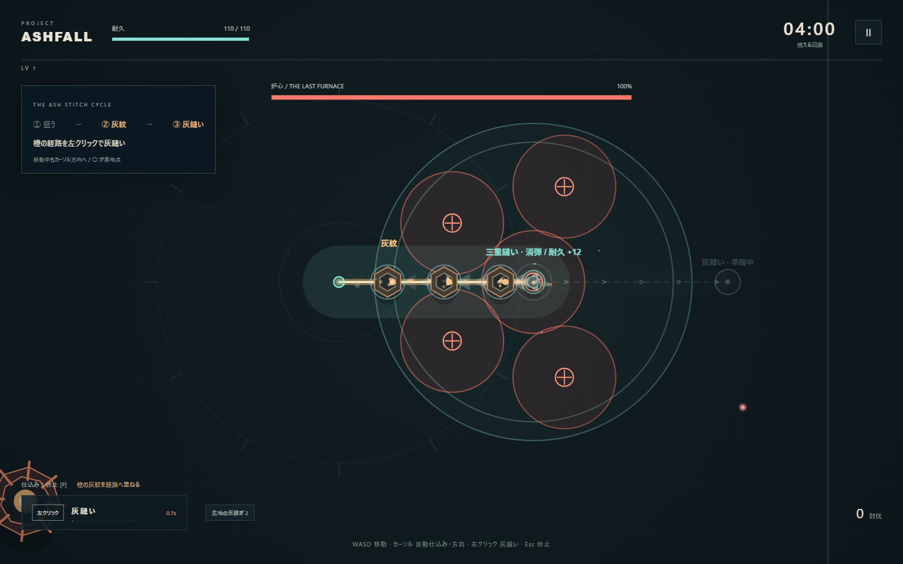
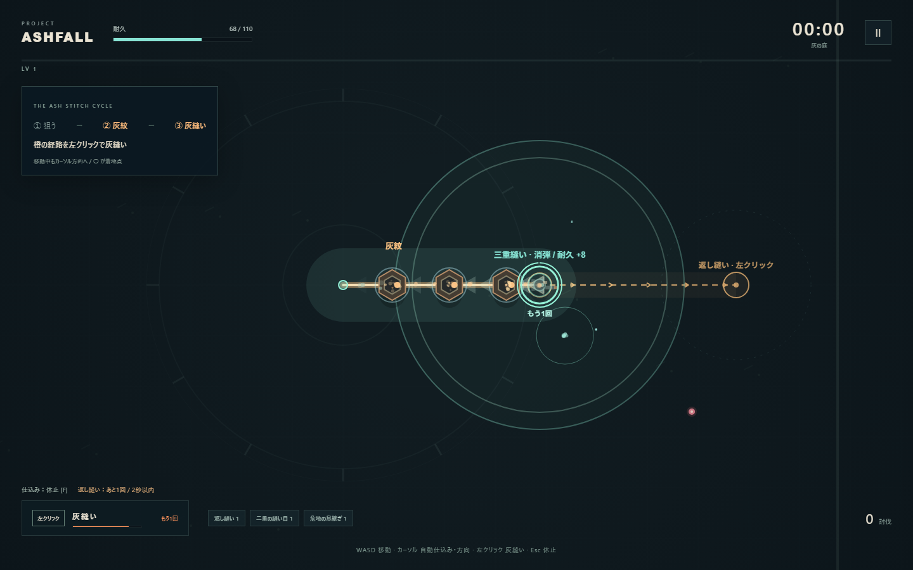

# Project Ashfall v0.4 検証結果

実施日：2026年10月1日。Windows、Node.js 22.23.1、ローカルChromium headless shell 1243。ゲーム本体の追加依存はありません。

## 主要機能：70項目合格

npm testで実際のgame.jsを実行。v0.3の入力・灰紋・段階的炸裂・成長・勝敗・休止を回帰確認し、v0.4の次の境界も検証しました。

- 灰なしで消弾領域なし。1体と3体では広さ・持続・回復が違う。予告と実際の範囲が一致。
- 着地の既存弾と高速で入る弾を消し、範囲外の弾は残す。消弾終了後は被弾する。地面の予告は三重縫いでも残る。番人・炉心の実際の予告攻撃も、領域内で予定どおり発動してダメージを与える。
- 追加攻撃は三重縫いから1回・2秒・灰持ち越し。追加攻撃から無限再付与しない。休止と再開・リスタートで状態を守る。
- 濃灰伝染は満杯から近い対象へ、再帰なし。地面配置と併存し、未刻印の敵へ衛星だけで燃料を作れない。
- 貫通＋跳弾で奥と横を両方仕込む。跳弾単独も働き、最大構成でも射撃だけで倒せず、弾・粒子・連鎖表示は有限。
- 近い照準の補正だけ働き、横や後ろの敵を自動選択しない。再炸裂が終点から進み、2段階目だけ幅が広がる。
- 導入中の入力と使用表示が一致。待機完了の発光、番人後の出現休止、敵密度制限、装備ロック・選択・実効果、強化カードの相乗効果説明。

## 今回の消弾対象修正のブラウザ確認

`node tests/hazard-check.cjs` で確認。飛翔弾2発が消え、同じ消弾領域内にある炉心の地面予告5箇所は保持されました。警告時間と寿命を短縮せず、着弾時は消弾領域がまだ有効でも耐久が24減少。領域の発生後に新しく出た予告も保持され、予定時刻に16ダメージを与えます。既存の強化・追加攻撃のブラウザ場面も再確認し、実行時例外は0件。詳細はhazard-verification.json。

## v0.4初版の実ブラウザ：27項目合格、実行時例外0件

以下の7分入力と画像は、地面の予告解除を撤去する前の記録です。今回の修正後に7分入力を再実施した結果ではありません。現在の仕様での範囲攻撃は、上記の短いブラウザ検証で切り分けて確認しています。

npm run test:browserで通常起動・用語、ヘルプ、音声の起動、敵なしの自動射撃から安全な3体への導入、WASD中の左クリックと予告した終点、休止、強化、勝敗と再開、装備の一覧・保存・適用、1024×640の配置、密集描画、ファイル直接起動を確認しました。仕上げの表示整理後に、最終ソースを再読み込みして導入・強化カード・演出・消弾・追加攻撃・直接起動も再確認しました。

続けて**ゲーム内7分を実時間のキー・マウス入力で操作**。体力、灰、経験値、時計へ値を追加せず、強化も数字キーで選びました。最初の番人後と5分以降の密度増加を含みます。

| 実時間の7分入力 | 結果 |
| --- | --- |
| 生存時間 | 420.11秒 |
| 耐久 | 130 / 130 |
| レベル・強化選択 | LV13 / 12回 |
| 討伐・灰のある灰縫い | 864体 / 245回 |
| 番人撃破 | 2体 |
| 三重縫い・追加攻撃 | 16回 / 16回 |
| 着地で消した敵弾 | 122発（経路上の消弾を除く） |
| 灰縫いのダメージ比率 | 94.95% |
| 初回の灰紋 → 灰縫い撃破 | 1.62秒 → 3.18秒 |

精密な照準と経路採点を使う自動プレイヤーです。人間の理解速度・楽しさの値としては扱いません。

回収・予熱・進行中の炸裂・最後の起爆は、明示的な3体の場面を設定し、各段階を止めて画像で確認。途中は爆発地点5／11・討伐1／3、最後は11地点・3体でv0.3の順序を維持しました。別の場面で三重縫いの消弾2発、爆発予告解除、追加攻撃への灰5の持ち越し、逆走の再炸裂、貫通の枝1本と伝染2本、待機リングの半周・完了を確認しました。

ボス・勝敗・装備ロック・密集・レイアウトにも明示的なテスト状態設定を使います。自然な7分とは分けて記録しています。表示の最終調整は回復と「もう1回」の文字の重なりを整理し、導入中の使用表示を実際の入力条件と一致させ、カードに現在の構成との組み合わせを追記したものです。戦闘の数値・挙動は7分の試行から変えていません。

詳細：browser-verification.json、docs/screenshots/。

## 加速シミュレーション

npm run test:balance。通常の耐久・経験値と固定シードを使い、値の追加なし。v0.3ブランチのソースは読み取り専用で取得。演出の停止時間を省略して高速計算し、正確な経路情報も使うため、人間や実時間入力と難度は一致しません。灰縫い後の追加攻撃も選べるよう自動入力を更新しました。

| 行動・構成 | シード | 結果 | 討伐 | 灰縫いのダメージ |
| --- | --- | --- | --- | --- |
| v0.3 直線配置優先 | 4721 | クリア 754秒 | 3715 | 97.3% |
| v0.4 射撃のみ | 4721 | 敗北 258秒 | 0 | 0.0% |
| v0.4 仕込みなし灰縫い | 4721 | 時間上限 300秒 | 0 | — |
| v0.4 直線配置優先 | 4721 | クリア 738秒 | 2327 | 94.9% |
| v0.4 濃灰優先 | 9481 | クリア 731秒 | 2344 | 98.8% |
| v0.4 地面配置優先 | 20261001 | クリア 762秒 | 2308 | 96.3% |

射撃のみ／仕込みなしでは討伐0、周期を回すと1分以内に灰縫い撃破、灰縫いがダメージの85%以上、5分以上の継続、少なくとも1構成のクリアに加え、三重縫い・消弾・追加攻撃が実際に生じることを回帰条件にしています。v0.4の3構成では三重縫い11〜65回・追加攻撃11〜46回・着地の消弾246〜377発。少数シードの結果からビルドの優劣や面白さは断定しません。

## 人間に残した確認

三重縫いで踏み込む判断、待機リングの理解、最初のクリックの納得、強化直後の変化、追加攻撃2秒の忙しさ、単体ボスでの選択差を見ます。音声が起動して例外なく生成されることは確認済みですが、聞き心地・初見の楽しさ・別PCの性能・Firefox/Safariは未確認。7分の実時間検証は1構成、他の構成は加速試行と独立した演出場面です。具体的な観察項目はdocs/V0.4-FLOW-AND-BUILDS.mdに記録しています。
