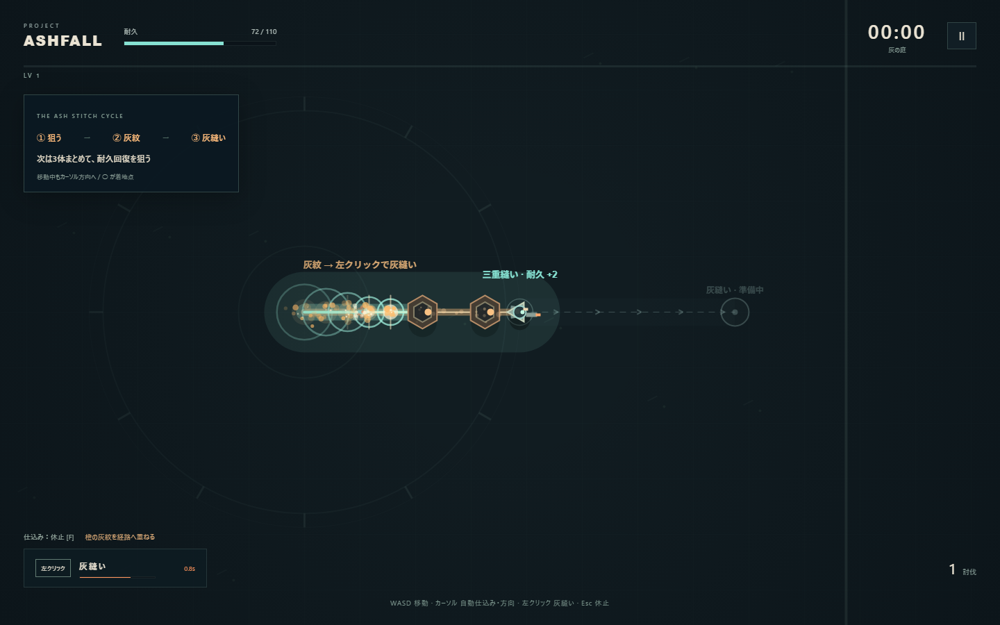

# Project Ashfall v0.3 検証結果

実施日：2026年10月1日。Windows、Node.js 22.23.1、ローカルChromium headless shell 1243。ゲーム本体の追加依存はありません。

## 主要機能：47項目合格

npm testで実際のgame.jsを実行。既存の仕込み・灰紋・回収・成長・勝敗・休止に加え、自動仕込みの初期値、WASDに依存しないカーソル方向、開始後の終点固定、壁で方向を曲げない短縮、クリック長押しで連打しないこと、SPACE代替、ゼロ距離の入力、予熱と始点からの段階的な命中、1体1回の命中、明示した3体の回復閾値、序盤の被ダメージ半減、射手なし、5分までの単発射撃と1体ずつの出現を確認しました。

## 実ブラウザ：22項目合格、実行時例外0件

npm run test:browserで通常起動・用語、ヘルプ、音声の起動、初回の自動仕込み、WASD移動中の左クリックと予告した終点、休止、強化、勝敗と再開、1024×640の配置、密集描画、ファイル直接起動を確認しました。

続けて**ゲーム内5分を実時間のキー・マウス入力で操作**。体力、灰、経験値、時計へ値を追加せず、強化も数字キーで選びました。

| 最終ソースによる5分の入力 | 結果 |
| --- | --- |
| 生存時間 | 300.10秒 |
| 耐久 | 110.0 / 110 |
| レベル・強化選択 | LV8 / 7回 |
| 討伐・灰のある灰縫い | 303体 / 143回 |
| 灰縫いのダメージ比率 | 95.31% |
| 初回の灰紋 → 灰縫い撃破 | 0.23秒 → 1.27秒 |

精密な照準と経路採点を使う自動プレイヤーです。人間の理解速度・楽しさの値としては扱いません。

回収・予熱・進行中の炸裂・最後の起爆は、明示的な3体の場面を設定し、各段階を停止して画像で確認しました。途中は爆発地点5／11、討伐1／3で、最後に11地点と3体へ進みます。ボス・勝敗・密集・レイアウトにも明示的なテスト状態設定を使います。自然な5分とは分けて記録しています。

詳細：browser-verification.json、docs/screenshots/。

## 加速シミュレーション

npm run test:balance。通常の耐久・経験値と固定シードを使い、値の追加なし。v0.2ブランチのソースは読み取り専用で取得します。演出の停止時間を省略して高速計算し、正確な経路情報も使うため、人間や実時間入力と難度は一致しません。

| 行動・構成 | シード | 結果 | 討伐 | 灰縫いのダメージ |
| --- | --- | --- | --- | --- |
| v0.2 直線配置優先 | 4721 | 時間上限 300秒 | 395 | 91.7% |
| v0.3 射撃のみ | 4721 | 敗北 234秒 | 0 | 0.0% |
| v0.3 仕込みなし灰縫い | 4721 | 敗北 244秒 | 0 | — |
| v0.3 直線配置優先 | 4721 | クリア 754秒 | 3715 | 97.3% |
| v0.3 濃灰優先 | 9481 | クリア 728秒 | 3867 | 99.1% |
| v0.3 地面配置優先 | 20261001 | 敗北 349秒 | 511 | 93.9% |

射撃のみ／仕込みなしでは討伐0、組み合わせると最初の1分以内に灰縫い撃破、灰縫いがダメージの85%以上、5分以上の継続、少なくとも1構成のクリアを回帰条件にしています。少数シードの結果からビルドの優劣や面白さは断定しません。

## 人間に残した確認

最初の3分に試す余裕があるか、一定距離の着地点が予測できるか、連続炸裂の遅れと音・振動・停止が気持ちよいか、3体をまとめたくなるか。後半の難度・構成差は今回広く調整していません。音声が起動して例外なく生成されることは確認済みですが、聞き心地、初見の楽しさ、別PCの性能、Firefox/Safariは未確認です。具体的な観察項目はdocs/V0.3-PLAY-FEEL.mdに記録しています。
