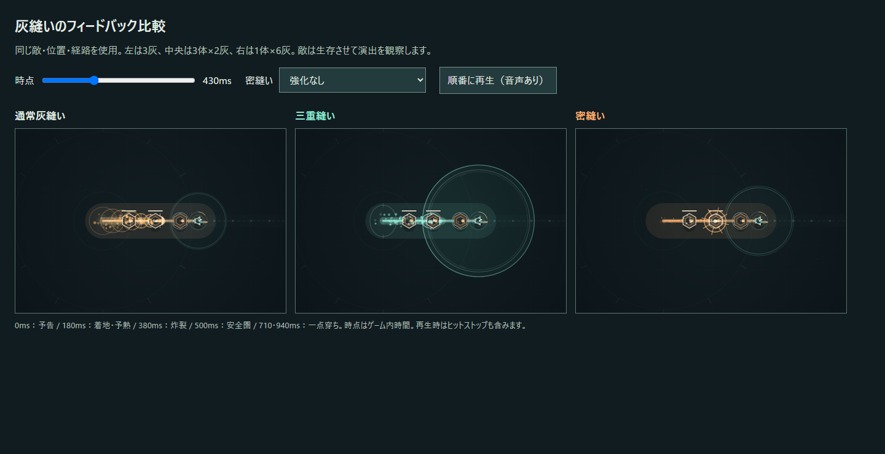

# v0.6.1 — 三重縫いと密縫いの手応え

基準は `work/v0.6-build-diversity` の `2be9dce`。作業ブランチは `work/v0.6-stitch-feedback`。成立条件・威力・灰圧・一点穿ち・消弾半径と持続・回復・待機短縮・返しと連環・敵とボス・出現密度・強化抽選は変更しない。

## 成功の視覚言語

| 成功 | 動き・色 | 音・手応え |
| --- | --- | --- |
| 通常 | 従来の橙の経路、外へ開く小さな炸裂 | 従来の炸裂音、45msのヒットストップ |
| 三重 | 青緑の予告・移動残像・導火線。始点・中央・終点から横へ開く波。着地消弾の境界と内側の誕生波 | 上へ抜ける音と帯域ノイズ。65msのヒットストップと既存の振動量 |
| 密縫い | 橙の予告・残像・細い発光。実際に命中した回収対象の位置へ縮む二重リング、内へ向かう光、白熱した芯 | 低く下がる音。70〜88msのヒットストップ、対象付近の小さな振動 |

三重の横波は経路全体へ11回重ねず、3か所だけで大きく開く。着地の誕生波は0.28秒で既存の消弾境界へ届き、その内側だけに描く。三重の消弾時には短い青緑の光を追加し、同時24個まで、0.22秒で消す。実際の当たり判定と飛翔弾の消滅は既存処理を使用する。地面攻撃は対象外。

密縫いは経路の炸裂を控えめにし、対象への本撃命中時に集中演出を出す。強化なし・倍率1でも収束リングと専用音を出す。密縫い倍率×その対象の灰圧倍率から、演出だけの強度を0〜1へ制限する。リングの基準半径30→38、光の本数8→12、停止70→88ms、音の低さと音量を少し変える。攻撃範囲と実ダメージはこの演出値を参照しない。

一点穿ちは従来の予熱後0.42秒、次は0.22秒後。元の対象への威力45%×1回／60%×2回を維持する。密縫い本体の内向きリングに対し、遅れて外へ開く菱形と縦の白い穿孔を使う。逆向きの二重の縫い目は従来の青緑の再炸裂を維持する。

## 実装と回帰の境界

`endDash()`から `normal / triple / dense` を `run.stitches` へ渡す。移動残像・炸裂ポイント・命中・音へ同じ種別を伝播する。密縫いの集中と一点穿ちは敵の上へ描き、番人・炉心の大きい姿にも光が隠れないようにする。全画面の橙フラッシュは通常に残し、成功の専用演出は局所へ寄せる。

追加の光はCanvasの規則的な図形で作る。戦闘用乱数を呼ばず、既存の粒子生成回数・寿命・650個の上限を変えない。音のノイズも従来どおり別の乱数源。既存粒子の色・移動速度・見た目のサイズだけを変える。

ヒットストップは従来の描画ループと同じく、壁時計に対してゲーム進行を短く止める。密縫いの停止が長い分だけ、実時間ではわずかに遅くなる。ゲーム内時間での攻撃タイミング・待機・敵行動の数値は同じ。停止を除く同一入力のシミュレーションを改修前と毎フレーム比較し、戦闘状態と次の乱数結果の一致を確認する。

## 比較する方法

`npm start` 後、[比較ページ](../tests/feedback-comparison.html)を `http://localhost:4173/tests/feedback-comparison.html` で開く。敵の位置・姿・経路は共通。通常は1体3灰、三重は3体各2灰、密縫いは1体6灰。観察用に敵HPを固定して生存させる。これは通常プレイのバランス検証とは別のテスト状態。

スライダーで予告・移動・着地・炸裂・消弾領域を同じ時点に止める。密縫いだけ「強化なし」「密縫いLv3＋灰圧Lv3」「一点穿ちLv2」を切り替えられる。「順番に再生」で実際のヒットストップと音を、通常→三重→密縫いの順に比較する。並列の音が混ざらないようにした。製品UIやチュートリアルには追加していない。

自動確認は `npm test` と `npm run test:feedback`。ブラウザ用の前提はREADMEの既存DevTools手順と同じ。比較画像は予告・着地・炸裂・安全圏・強化密縫い・一点穿ちの6枚。音は起動したWeb Audioの実グラフと設定を検証する。音を聴いた人の印象やプレイの面白さを自動assertから断定しない。

## 次の人間プレイ

- 短い成功文字を見ず、音と光だけで三重／密縫いを区別できるか。
- 三重の青緑の予告から、横へ広がる炸裂と着地の安全圏が自然につながるか。
- 消えた敵弾が見え、地面の赤い危険予告は引き続き読めるか。
- 密縫いの基礎成功でも収束が分かり、倍率1が過剰な火力に見えないか。
- 密縫い・灰圧取得後は少し重くなったと感じるか。停止が連続プレイを邪魔しないか。
- 番人・ボスの大きい姿でも密縫いの集中が見えるか。
- 一点穿ちを本撃の後の追加炸裂として読めるか。二重の縫い目とも区別できるか。
- 終盤の跳弾・伝染・三重・返しの連続で、光が敵弾や次の経路を隠さないか。

数値バランスの追加変更は行っていない。基礎密縫いが倍率1であることと、ヒットストップが実時間のテンポへ及ぼす影響を観察する。人間プレイで気になる強さが見つかっても、この改修では演出とバランスの問題を分けて記録する。
