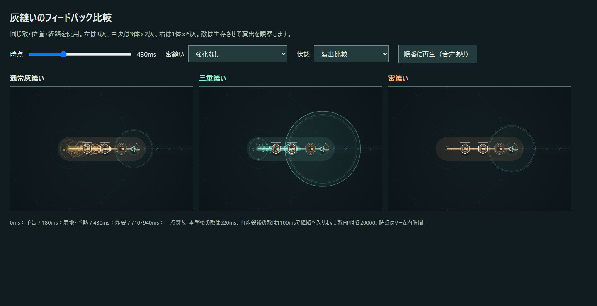
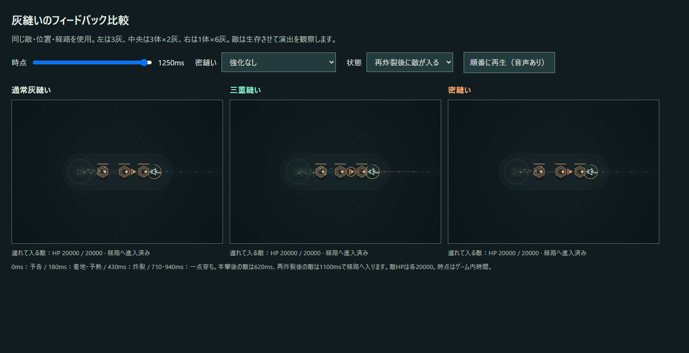

# v0.6.2 — 聞こえ方・見え方・当たり方をそろえる

基準は `work/v0.6-stitch-feedback` の `dae2977`。作業ブランチは `work/v0.6.2-stitch-timing`。v0.6.1の人間確認で、密縫いの音が通常との差を伝えにくいこと、対象の収束が追加ダメージに見えること、通過後の経路へ入ると突然被弾することが分かった。

## 密縫いの短い圧縮音

密縫い本撃は、通常の2つのトーンを再利用せず、歪みを軽く付けた三角波の1打にする。2msで立ち上がり、約100Hzから42Hzへ65msで落とし、120msで減衰。750Hz帯域の45msノイズを短いアタックに重ねる。基礎密縫いでも同じ専用音が出る。強い密縫い／灰圧では初期周波数を最大8Hz下げ、厚みを少し増やす。音量だけで三重と競わせない。

通常の炸裂音と三重の上へ抜ける音は維持する。密縫いの経路ノードごとの通常風の短音と、本撃命中時の共通低音を重ねない。逆向き再炸裂の音と一点穿ちの遅れた炸裂音は別に残す。音のノイズは戦闘用乱数を使わない。

## 密縫いは経路全体の重い本撃

導火線を細く白熱させ、前線の白い芯と各ノードの小さな光を強める。外へ広い爆発輪を追加しない。密縫い本体の倍率は従来どおり経路上の全命中へ適用するため、灰を回収していない経路内の敵にも本撃と同時に0.14秒の橙／白の閃光を出す。

回収対象のリングは小さな細線の成功マーカーに抑える。大きな二重リング・収束する多数の光・対象単位の振動を外し、独立した追加攻撃に見せない。v0.6.1の70〜88msのヒットストップと微量の全画面振動は維持する。一点穿ちだけが、遅れて菱形と縦の白い穿孔、大きい粒子を発生させる。

## 前線が通過したときだけ命中する

旧判定は「敵の位置が現在の前線より後ろ」であれば、stitchが生きている限り命中できた。これを廃止し、残光の寿命とダメージの有効時間を分ける。

| 攻撃 | 有効時間・方向 | 遅れて入る敵 |
| --- | --- | --- |
| 本撃 | 着地後0.09秒の予熱、続く0.28秒の始点→終点の前線通過 | その位置を前線が通過した後なら命中しない |
| 二重の縫い目 | 本撃の予熱終了から0.5秒後に開始、0.28秒の終点→始点の前線通過 | 再炸裂がその位置を通過した後なら命中しない |
| 一点穿ち | 本撃の予熱終了から0.42秒後、次は0.22秒後。元の単体対象に追従 | 経路内外を問わず生きている元の対象へ追加命中 |

本撃・再炸裂は、フレーム開始前の敵の位置と更新後の位置を記録して連続的に調べる。前線と敵の経路方向への投影が交差する時刻を求め、その時刻の敵位置が既存の炸裂幅に入るかを確認する。予熱終了・前線終了がフレーム途中に来る場合は、その有効区間だけを使う。始点・終点の投影が切り替わる場所で区間を分け、高速runnerや斜めの経路も取りこぼさない。

攻撃が命中して生まれたsplitterの子は、そのフレーム開始時には存在しないため、過去の前線へさかのぼって命中させない。次のフレームから通常の通過判定へ入る。敵は各本撃・再炸裂で一度だけ命中し、既存のhitIds／echoIdsで管理する。

0.035経路分の先読み命中も外し、前線の到達時刻にそろえる。終了した経路の線を薄い残光へ変え、残るstitch・煙・光にダメージはないことを示す。別の床ダメージや残留攻撃は追加しない。

## 維持した数値と回帰

密縫い／灰圧倍率、成功条件、三重報酬、回復、消弾、灰の伝播、残灰弾の発射条件と上限、返し／連環、敵とボス、密度、ラン時間、経験値曲線、強化抽選は維持する。二重の縫い目の75%／100%、Lv2の幅1.35倍、一点穿ちの45%×1回／60%×2回も同じ。`upgrades.js` は基準コミットと同一。

命中タイミングと残留判定の変更で、討伐・経験値・乱数の進行・取得順・通し結果は変わり得る。DPSの補填や敵の弱体化は行わない。通しシミュレーションの結果を合わせる調整も行わない。結果の差は [検証記録](../TEST-REPORT.md)に記録する。

実時間の通常入力テストは初回329.1秒で死亡し、以前の420秒生存検査が停止した。死亡を観測結果として記録して、残る画面・演出・回帰検査へ進めるようテストを更新した。これは生存や難易度維持を証明するものではなく、次の人間確認で判断する材料とする。

## 比較する方法

`npm start` 後、`http://localhost:4173/tests/feedback-comparison.html` を開く。通常・三重・基礎密縫いを同じ配置で比較し、「密縫いLv3＋灰圧Lv3」「一点穿ちLv2」を切り替える。順番に再生すると音を混ぜずに聞ける。

「状態」を「本撃後に敵が入る」にすると620ms、「再炸裂後に敵が入る」にすると1100msで、観察用runnerを経路へ移す。850ms／1250msの表示ではHP20000を保つ。これは明示的なテスト配置で、通常のランに敵やHPを注入する機能ではない。

## 次の人間確認

- 音だけで密縫いを通常・三重から識別できるか。短い圧縮音にアタックと重さがあるか。
- 密縫いが「経路全体の炸裂が濃くなる」と感じられるか。基礎成功が過剰な倍率に見えないか。
- 一点穿ちだけを、元の対象への遅れた個別追加炸裂として読めるか。
- 前線をまだ受けていない敵への命中時刻が、光の到達と一致しているか。
- 本撃・再炸裂後の残光へ敵が入っても、不自然な爆散が起きないか。
- 高速runner、番人・炉心、斜め・壁際の経路で命中に違和感がないか。
- 残留ダメージ削除で火力不足や爽快感低下を感じるか。群れの処理、三重→返し→連環の連続が保たれるか。

ブラウザの実描画とWeb Audio出力設定を検証し、残留判定と高速移動を自動テストする。聴感・学習のしやすさ・面白さは人間プレイの結果から判断する。
