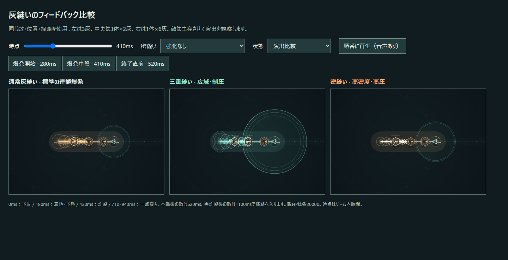
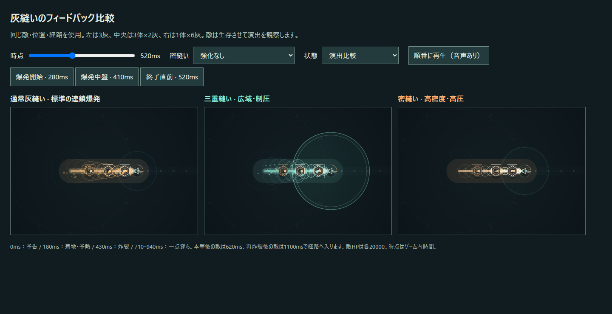

# v0.6.3 — 同じ灰縫いの連鎖爆発を3つの状態へ

基準は `work/v0.6.2-stitch-timing` の `028ca08`。作業ブランチは `work/v0.6.3-stitch-chain-visuals`。人間確認で、通常の爆導索のような連鎖が好評だった一方、密縫い・三重縫いの本体は相対的に弱く見えた。通常版を基準として保ち、特殊成功側の連鎖爆発を調整した。

## 共通の順次炸裂

3種類とも既存の11ノードが始点から終点へ順番に炸裂する。予熱0.09秒、前線0.28秒、ノードの寿命0.32秒は同じ。通常版の導火線・橙の膨らむ輪・白熱した芯・十字の閃光・音を維持する。開始・中盤・終了時の通常版の描画命令が改修前と一致することも検証する。

| 状態 | 経路の連鎖爆発 | 補助表現 |
| --- | --- | --- |
| 通常 | 橙の標準的な炸裂輪と白熱、従来の太さ | 基準となる爆導索の連鎖感 |
| 密縫い | 小さめの圧縮輪と明るい白～黄の芯。ノード間にも小さな光を置き、隙間を詰める | 回収対象の小さな収束マーカー、既存の重い停止と振動 |
| 三重縫い | 全ノードで白い閃光と青緑の爆発輪。経路に垂直な方向へ広がる | 始点・中央・終点の制圧波、着地消弾の誕生波、弾消滅の青緑 |

密縫いの橙の外側は控えめにし、明るい芯の重なりを加算描画する。通常の輪を単純に大きくする方法は使わない。対象付近のマーカーと本撃ヒット時の短い閃光はv0.6.2のまま。一点穿ちの菱形・縦の穿孔は、本撃後に元の対象へ発生する個別追加攻撃として維持する。

三重縫いでは、節目だけでなく各ノードに膨らむ爆発の輪郭を追加する。外へ展開する波が経路の連鎖に続き、その青緑が着地の安全圏へつながる。画面全体を覆う新しいフラッシュは加えない。

ノード間の密縫いの光と三重の広域輪は描画だけで作る。stitch・impact・戦闘用粒子を追加生成せず、ノード数や戦闘乱数の消費を増やさない。既存の減衰を使い、残光は引き続き無害。

## 同じ技の音の変奏

通常の開始音は72Hzの下降音＋140Hzの短い下降音。連鎖の途中は3・6・9番ノードの下降音。この基礎音は維持する。

密縫いでは同じ72／140Hzの開始音を短く控えめに重ね、v0.6.2の歪み付き低音、2msのアタック、120msの減衰、45msのノイズを残す。途中の下降音も短く低く鳴らし、単発の重打で終わらず連鎖を聞けるようにする。強化による低さ・厚みの微量の変化は従来どおり。

三重縫いでは共通の下降音に、上へ抜ける音を重ねる。既存の上昇音の音量を抑えて共通音を足し、単純な音量競争にはしない。途中のノードも下降音＋上昇音の2層。逆向き再炸裂・一点穿ちの音は維持する。音声用のノイズは戦闘用の乱数を使わない。

## 当たり方と性能はv0.6.2のまま

本撃・二重の縫い目は炸裂前線が通過した瞬間だけ命中する。前線の通過後へ入る敵には当たらない。高速runnerの連続判定、予熱・終了のフレーム途中の判定も維持する。一点穿ちは0.42秒後、Lv2はさらに0.22秒後に元の対象へ追従する。

通常ダメージ、密縫い・灰圧・一点穿ち倍率、成功条件、三重報酬、消弾半径と持続、回復、返し・連環、敵・ボス、密度、ラン時間、強化抽選、経験値曲線は変更していない。ヒットストップ・画面振動と戦闘用粒子も変更していない。`upgrades.js` は基準とバイト単位で同じ。

7構成で各360フレーム、描画と音声を動かして戦闘状態・粒子・ダメージを比較する。新しい描画用の間隔情報だけを除き、impactの数を含む全run状態を比較する。音のON/OFFと描画回数を変えても、その後の敵生成20体と強化抽選が一致する。通し検証は同じ6seedで結果・取得・ダメージ・途中サンプルの一致をassertする。[検証記録](../TEST-REPORT.md)に結果を残す。自動検証から気持ちよさや演出の格を断定しない。

## 比較ページ

`npm start` 後、`http://localhost:4173/tests/feedback-comparison.html` を開く。

- 「爆発開始 · 280ms」「爆発中盤 · 410ms」「終了直前 · 520ms」で3種類を同じ時点に止める。
- スライダーで予告から残光まで確認する。「順番に再生」で3種類を混ぜずに聞く。
- 「密縫いLv3＋灰圧Lv3」「一点穿ちLv2」で基礎成功・高倍率・遅れた追加攻撃を比較する。
- 本撃後／再炸裂後に敵が入る状態も維持し、残光の無害を確認する。

## 次の人間確認

- 通常灰縫いの連鎖爆発の気持ちよさが維持されているか。
- 密縫いが通常より「重く濃い」と感じるか。小さい輪でも圧力と白熱が伝わるか。
- 三重縫いが通常より「広く制圧的」と感じるか。爆発から安全圏へ自然につながるか。
- 3種類とも同じ灰縫いの派生に見えるか。音にも共通の連鎖を感じるか。
- 基礎密縫いを含む特殊成功が、通常より格下に見えないか。
- 密縫い本体を経路全体の強化と読み、一点穿ちだけを遅れた個別追加炸裂と区別できるか。
- 終盤の三重→返し→連環や再炸裂の重なりで、敵弾・地面予告が隠れたり画面がうるさくなったりしないか。

ブラウザの実描画とWeb Audioグラフは検証する。音の重さ・演出の優劣・連続操作時の爽快感は次の人間確認で評価する。
